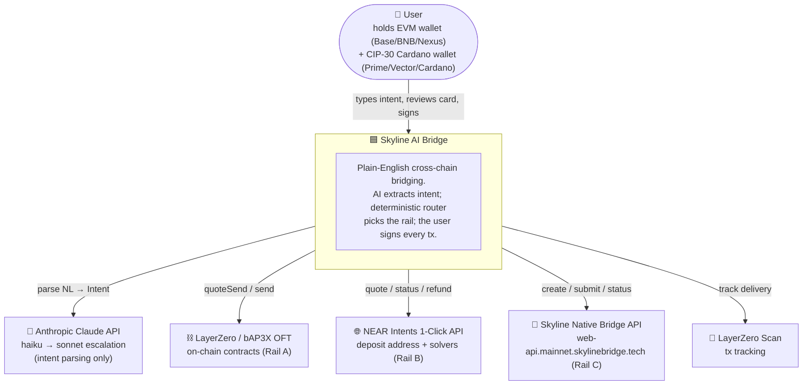
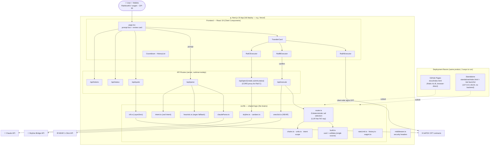
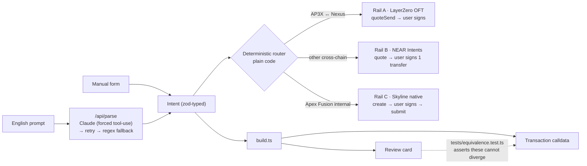

# Architecture — Skyline AI Bridge

Documented with the [C4 model](https://c4model.com) (Context + Container levels),
rendered in Mermaid so it displays inline on GitHub. C4 is the pragmatic industry
default for showing UI, backend, and infrastructure together at increasing zoom.

---

## Level 1 — System Context

The big picture: who uses the system and which external systems it depends on.

---

## Level 2 — Container Diagram

The runnable/deployable units (frontend, API routes, shared logic) plus the
three deployment flavors. This is the main view: it shows the **UI**,
**software components**, and **infrastructure / external integrations** together.

---

## The core safety property

Parsing and routing are deliberately separated, and the model is fenced out of
both money decisions:

> The review card and the signed calldata are built **by the same function from
> the same validated Intent**. `tests/equivalence.test.ts` enforces that they can
> never diverge — that is the central trust guarantee. The AI emits JSON only; it
> never picks the rail and never signs.

---

### Legend / mapping to your question

| You asked about | Where it lives in the diagrams |
| --- | --- |
| **UI** | `Frontend — React 19` box: `page.tsx`, `TransferCard`, the three `Rail*Executor`s, `Countdown`, `HistoryList` |
| **Software components** | `src/lib` box — `router`, `intent`, `build`, parsers, and per-rail adapters |
| **Infrastructure** | API routes (server runtime), `middleware`, the 3 deployment flavors, and external systems (Claude, LayerZero, NEAR, Skyline) |
| **Data / control flow** | Arrows; the safety diagram shows the parse → route → execute pipeline |
